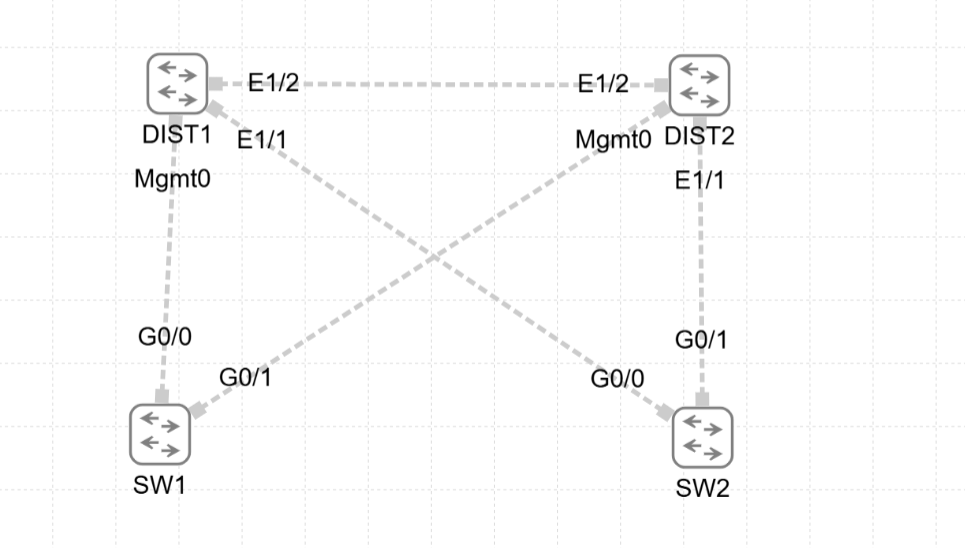
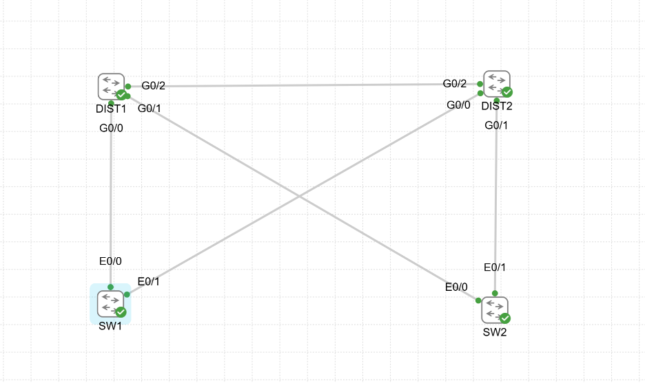
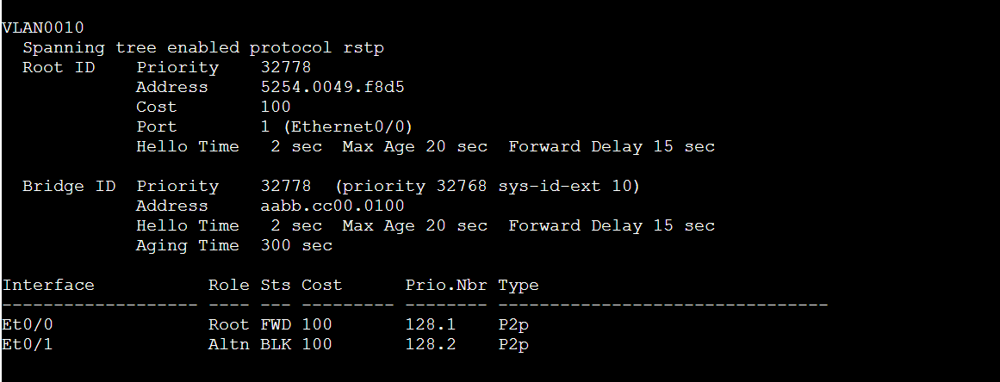
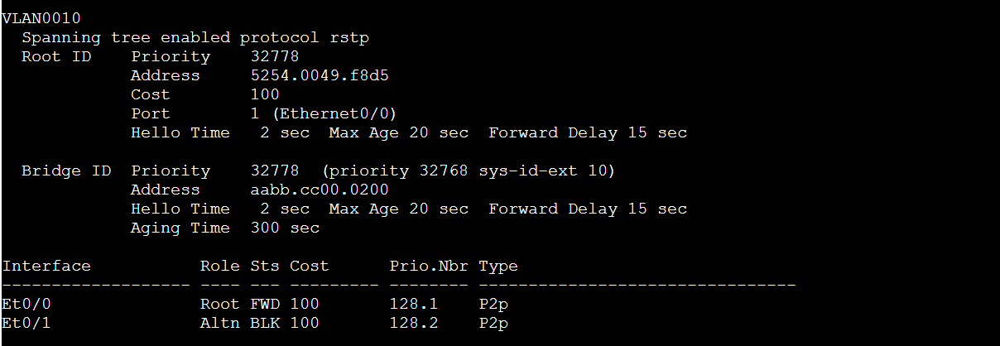
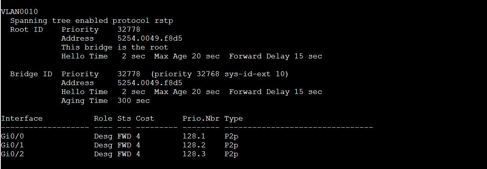
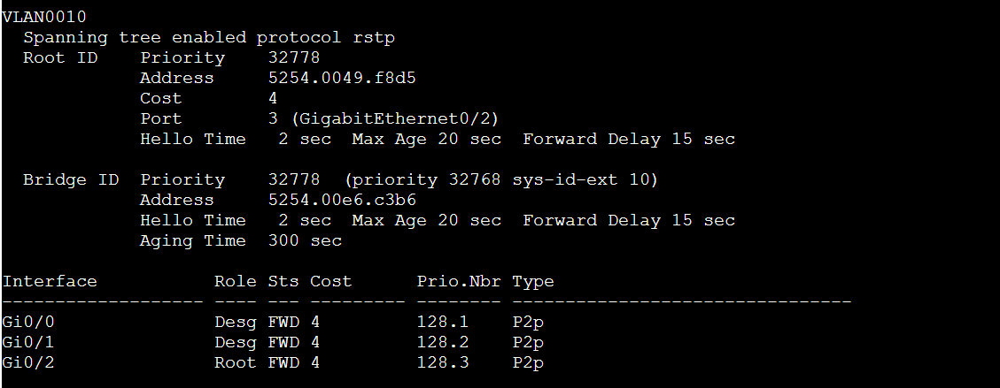

# CCNP Campus Design Lab 01 — Rapid PVST+ in a Looped Layer 2 Topology

## Lab goal
Build a simple four-switch Layer 2 campus block, stretch a single VLAN across redundant paths, and validate how **Rapid PVST+** prevents loops by creating a loop-free tree. The lab specifically demonstrates:

- root bridge election
- root, designated, and alternate port roles
- blocked-path behavior in a looped topology
- the practical bandwidth tradeoff created by STP
- control-plane convergence after loss of the active uplink

This report is intentionally focused on **STP mechanics**, not on the later bandwidth/convergence comparison against routed or logical-switch designs.

---

## Topology used in CML

### Planned topology
    

### Running topology


### Device roles
- **DIST1** — distribution switch, configured as **Rapid PVST+ root primary** for VLAN 10
- **DIST2** — distribution switch, configured as **Rapid PVST+ root secondary** for VLAN 10
- **SW1** — access switch dual-homed to both distribution switches
- **SW2** — access switch dual-homed to both distribution switches

### Interface map
| Device | Interface | Connected to |
|---|---|---|
| DIST1 | G0/0 | SW1 E0/0 |
| DIST1 | G0/1 | SW2 E0/0 |
| DIST1 | G0/2 | DIST2 G0/2 |
| DIST2 | G0/0 | SW1 E0/1 |
| DIST2 | G0/1 | SW2 E0/1 |
| DIST2 | G0/2 | DIST1 G0/2 |

### Layer 2 design
- Single VLAN carried end-to-end: **VLAN 10**
- All inter-switch links configured as **802.1Q trunks** allowing VLAN 10
- STP mode: **Rapid PVST+**

Because VLAN 10 is extended across redundant Layer 2 paths, the topology has **loop potential**. Rapid PVST+ is therefore required to place selected ports into a non-forwarding role and create a loop-free forwarding tree.

---

## Configurations

### SW1
```cisco
hostname SW1
no ip routing
spanning-tree mode rapid-pvst

vlan 10
 name VLAN10_USERS

interface e0/0
 description Uplink_to_DIST1
 switchport mode trunk
 switchport trunk allowed vlan 10
 no shutdown

interface e0/1
 description Uplink_to_DIST2
 switchport mode trunk
 switchport trunk allowed vlan 10
 no shutdown
```

### SW2
```cisco
hostname SW2
no ip routing
spanning-tree mode rapid-pvst

vlan 10
 name VLAN10_USERS

interface e0/0
 description Uplink_to_DIST1
 switchport mode trunk
 switchport trunk allowed vlan 10
 no shutdown

interface e0/1
 description Uplink_to_DIST2
 switchport mode trunk
 switchport trunk allowed vlan 10
 no shutdown
```

### DIST1
```cisco
hostname DIST1
no ip routing
spanning-tree mode rapid-pvst

vlan 10
 name VLAN10_USERS

spanning-tree vlan 10 root primary

interface g0/0
 description Link_to_SW1
 switchport mode trunk
 switchport trunk allowed vlan 10
 no shutdown

interface g0/1
 description Link_to_SW2
 switchport mode trunk
 switchport trunk allowed vlan 10
 no shutdown

interface g0/2
 description Link_to_DIST2
 switchport mode trunk
 switchport trunk allowed vlan 10
 no shutdown
```

### DIST2
```cisco
hostname DIST2
no ip routing
spanning-tree mode rapid-pvst

vlan 10
 name VLAN10_USERS

spanning-tree vlan 10 root secondary

interface g0/0
 description Link_to_SW1
 switchport mode trunk
 switchport trunk allowed vlan 10
 no shutdown

interface g0/1
 description Link_to_SW2
 switchport mode trunk
 switchport trunk allowed vlan 10
 no shutdown

interface g0/2
 description Link_to_DIST1
 switchport mode trunk
 switchport trunk allowed vlan 10
 no shutdown
```

---

## Verification outputs

### SW1 — `show spanning-tree vlan 10`


Observed state:
- `Et0/0` = **Root / Forwarding**
- `Et0/1` = **Alternate / Blocking**
- Root path cost = `100`

Interpretation:
- SW1 selected **Et0/0** as its best path toward the root bridge.
- The redundant uplink **Et0/1** was correctly placed into the alternate blocking state.

### SW2 — `show spanning-tree vlan 10`


Observed state:
- `Et0/0` = **Root / Forwarding**
- `Et0/1` = **Alternate / Blocking**
- Root path cost = `100`

Interpretation:
- SW2 mirrored SW1 behavior: one uplink was selected as the active root path, and the other was held as an alternate path.

### DIST1 — `show spanning-tree vlan 10`


Observed state:
- `This bridge is the root`
- `Gi0/0`, `Gi0/1`, `Gi0/2` = **Designated / Forwarding**

Interpretation:
- DIST1 successfully became the **root bridge** for VLAN 10.
- As the root, DIST1 had no root port; all participating ports were designated forwarding ports.

### DIST2 — `show spanning-tree vlan 10`


Observed state:
- Root path points to `Gi0/2`
- `Gi0/2` = **Root / Forwarding**
- `Gi0/0` and `Gi0/1` = **Designated / Forwarding**

Interpretation:
- DIST2 reached the root bridge through the direct inter-distribution link on **Gi0/2**.
- DIST2 still advertised designated forwarding roles toward the access layer.

---

## STP role summary

| Switch | Port | Role | State |
|---|---|---|---|
| SW1 | E0/0 | Root | Forwarding |
| SW1 | E0/1 | Alternate | Blocking |
| SW2 | E0/0 | Root | Forwarding |
| SW2 | E0/1 | Alternate | Blocking |
| DIST1 | G0/0 | Designated | Forwarding |
| DIST1 | G0/1 | Designated | Forwarding |
| DIST1 | G0/2 | Designated | Forwarding |
| DIST2 | G0/0 | Designated | Forwarding |
| DIST2 | G0/1 | Designated | Forwarding |
| DIST2 | G0/2 | Root | Forwarding |

### Manual interpretation
From the outputs alone, the topology can be reasoned out as follows:
1. **DIST1** won root bridge election.
2. **SW1** and **SW2** each chose their lowest-cost path to DIST1 through `E0/0`.
3. Their second uplinks (`E0/1`) became alternate blocking ports.
4. **DIST2** reached the root through its direct link `G0/2` to DIST1.
5. STP therefore built a loop-free tree while preserving alternate paths for failure recovery.

---

## Bandwidth implication of STP in this topology

A key outcome of this lab is that physical redundancy does **not** mean all installed link capacity can forward traffic simultaneously.

### Access-layer observation
Each access switch had **two physical uplinks**, but only **one uplink per switch** was forwarding for VLAN 10:
- SW1: 1 forwarding + 1 blocked
- SW2: 1 forwarding + 1 blocked

### Practical conclusion
For this single-VLAN Layer 2 design:
- each access switch had roughly **50% effective uplink utilization**
- the blocked path still existed as redundancy, but it did **not** carry user traffic while the topology was stable

This is the classic STP tradeoff: **loop prevention is achieved by sacrificing simultaneous use of some redundant links**.

A careful distinction is necessary at the distribution layer:
- DIST1 and DIST2 showed forwarding states on their participating ports,
- but that does **not** mean traffic was evenly load-balanced across every physical link.
- Forwarding still followed the spanning-tree topology rooted at DIST1.

---

## Convergence test

### Test objective
Validate that Rapid PVST+ can promote the blocked alternate path when the active root path fails.

### Action taken on SW1
The active uplink was manually shut down:
```cisco
conf t
interface e0/0
 shutdown
end
```

### Relevant syslog / RSTP events
Stored in: [`logs/convergence_syslog_snippet.txt`](stp_lab_report_package/logs/convergence_syslog_snippet.txt)

Key timestamps from SW1:
```text
*Apr  1 00:34:15.192: RSTP(10): updt roles, root port Et0/0 going down
*Apr  1 00:34:15.192: RSTP(10): Et0/1 is now root port
*Apr  1 00:34:15.194: RSTP(10): starting topology change timer for 35 seconds
*Apr  1 00:34:15.194: STP[10]: Generating TC trap for port Ethernet0/1
```

### Post-failure result on SW1
After the failure:
- `Et0/1` changed from **Alternate / Blocking** to **Root / Forwarding**
- root path cost changed from `100` to `104`
- the new path to the root was now via DIST2 instead of the original direct uplink

### Interpretation
The timestamps show that **control-plane role recalculation happened essentially immediately** in the log stream when the active uplink was shut down. This is valid evidence of **Rapid PVST+ control-plane convergence**.

However, to stay technically precise:
- this lab **did not** measure end-to-end application traffic recovery with hosts,
- so the result should be described as **STP control-plane convergence**, not full user-plane recovery timing.

---

## What this lab proved

This lab successfully demonstrated the core operational behavior of Rapid PVST+ in a looped Layer 2 campus topology:

1. A single VLAN stretched across redundant Layer 2 paths creates **loop potential**.
2. Rapid PVST+ prevents an active loop by electing a **root bridge** and assigning **root / designated / alternate** roles.
3. Redundant links are preserved for resiliency, but some links are placed into a **blocking** state during normal operation.
4. That behavior reduces effective bandwidth utilization at the access layer.
5. When the active path fails, Rapid PVST+ can quickly promote the alternate path and rebuild a valid forwarding tree.

---

## Final takeaway

This was a successful baseline STP lab for CCNP campus design study.

The topology was intentionally simple, but it exposed the exact tradeoff that later campus designs try to improve:
- **STP-based Layer 2 redundancy is stable and effective**,
- but it can strand usable bandwidth and requires topology reconvergence after failures.


